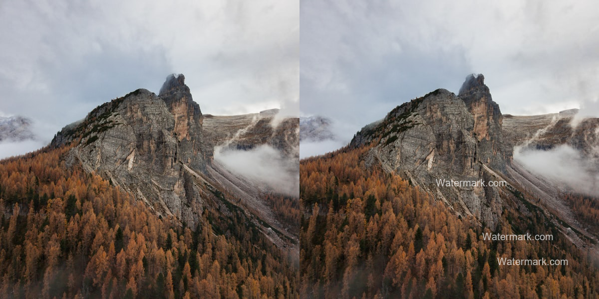
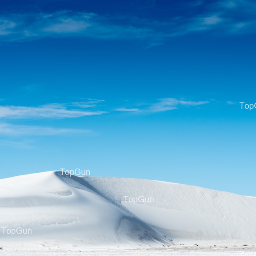
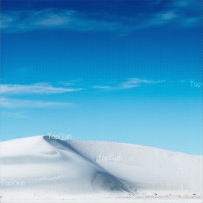

 

# Image Watermark Remover with Pytorch
Many images on the internet contain watermarks, but sometimes you want the image without the watermark. In this project I implement a `Pix2Pix` model in Pytorch to remove watermarks from images. The dataset I used was created using [Unsplash's Lite Dataset](https://unsplash.com/data); a dataset which contains no watermarked images. I also used [Aladdin Persson's](https://www.youtube.com/c/AladdinPersson) YouTube tutorial as reference to implement the `Pix2Pix` model to remove watermarks.

## Table of Contents
- [Image Collection](#image-collection)
  - [Initial Collection Method](#initial-collection-method)
  - [Final Collection Method](#final-collection-method)
- [Dataset Creation](#dataset-creation)
- [Model and Training](#model-and-training)
- [Evaluation](#evaluation)
- [Extra Notes](#extra-notes)
- [Resources](#resources)
  - [Datasets](#datasets)
  - [Models and Training](#models-and-training)
  - [Miscellaneous](#miscellaneous)

## Image Collection
When working on this project, the first thing I needed to do was collect a load of images which did not contain any watermarks. I remember from my data science course that a website called [Unsplash](https://unsplash.com/) was an image database full of copyright free images; therefor no watermarks. Because of this, I decided to use Unsplash to collect my images.

### Initial Collection Method
My initial method for collecting images for my dataset was to use [Unsplash's API](https://unsplash.com/developers). This API allows the user to send a search term (e.g. 'San Diego') and receive up to 30 results. In each result returned was information about the image, including the url to that image. Using this API, I created a function called `collect_images()` in [data_collection.py](https://github.com/osyounis/image_watermark_remover/blob/develop/code/data_collection.py) which takes in a search term and collects the urls of the 30 returned results. Then for each url, I save the image to my computer.

This method worked but was extremely slow since I was downloading the raw images. This also meant that when it came to training my model, it would take and extremely long time, due to the size of the images. Since I was only able to receive 30 results per search term, this meant I would have to come up with a long list of search terms in order to get a sizeable dataset. After finding out how long it takes to download images this was as well as realizing I would need a ridiculous amount of search terms, I decided to try and find a better way to get enough images for my data.

### Final Collection Method
After trying to find a better way to collect images for my dataset, I found out that Unsplash has it's own [datasets](https://unsplash.com/data). One dataset was the **Unsplash Lite** dataset and the **Unsplash Full** dataset. The **Lite** dataset comes has 25,000 images which are free to use, so that was the dataset I decided to use. This dataset comes with multiple `.tsv` files; *Tab Separated Variables.* One of these `.tsv` files is [photos.tsv000](https://github.com/osyounis/image_watermark_remover/blob/develop/data/unsplash_dataset/photos.tsv000) which contains information about images in the dataset. In this file, each image is on it's own line and each line contains various information about the image. One these pieces is a dynamic link to the image. Because of this, it meant I had a bunch of links straight to images. This meant I could not only download images faster, but use the dynamic link to crop the image from it's raw size, to a manage 600x600 pixel image. To see more about this, you can check out the [Lite Dataset's Docs](https://github.com/osyounis/image_watermark_remover/blob/develop/data/unsplash_dataset/DOCS.md) and my [analysis_of_unsplash_dataset.ipynb](https://github.com/osyounis/image_watermark_remover/blob/develop/data/unsplash_dataset/analysis_of_unsplash_dataset.ipynb).

## Dataset Creation
After collecting all the images I needed (I managed to download around 16,700 images), I needed to create new images that would be used for training. To do this, I create a copy of the image in question, add a watermark to it and create a new image with the original and watermarked versions side by side. Below is an example of this:

I created these training images for every original image I downloaded. Each image also has it's own watermark with different texts and random locations. You can see more of this in the [data_collection.py](https://github.com/osyounis/image_watermark_remover/blob/develop/code/data_collection.py) file. After that I randomly took 20% of my training images out and saved them to be used as validation images.

Next I created a Dataset class in [dataset.py](https://github.com/osyounis/image_watermark_remover/blob/develop/code/dataset.py) file. This class is how I load the data into my model. The class also takes each image, adds some augmentations to it, and splits it down the middle into two images: the **input** image and the **target** image. The **input** image contains the watermark, and the **target** image contains no watermark. These images are then fed into the Pix2Pix model for training.

## Model and Training
As mentioned before, the model I used for this project is the Pix2Pix model. The Pix2Pix model contains two parts: a **generator** and a **discriminator**. The **generator** was heavy based on a **U-NET** model where you down sample and then up sample the data. As for the **discriminator** it is just a few CNN layers. I used [Aladdin Persson's Pix2Pix Implementation Tutorial](https://youtu.be/SuddDSqGRzg) and the [Pix2Pix Paper](https://arxiv.org/abs/1611.07004) to create these models. 

I also used Aladdin's tutorial as a reference for writing the training loop for my model. As the model is trained, checkpoints are saved for the model's **discriminator** and **generator** every 5 epochs. Furthermore, a sample image is saved for each epoch, showing you the target image, the input image and the generated image. I will go more into this in the [Evaluations](#evaluation) section. If you plan on using this code, you can use the [settings.py](https://github.com/osyounis/image_watermark_remover/blob/develop/code/settings.py) to adust the training parameters for your system.

## Evaluation
Training my model took a very long time. Unfortunately I was only able to train my model over 25 epochs. Due to my computer's cpu cores and gpu, each epoch took around 12 minutes to train. In order to complete 100 epochs, it would take my computer 20 hours to complete. That being said, I did add my checkpoints to this repo so other could continue training from that point if they wanted to. Also you can see a sample of the generated image next to the target image here:

|Input Image| Generated Image | Target Image |
|-----------|-----------------|--------------|
||||

If I were to continue this project and wasn't pressed for time, I would like to have run the training for more than 100 epochs. I would also have tried scaling the the images even smaller; instead of using 600x600 pixels I would have liked to use 256x256 pixels instead.

Also I would like to update my code to download images more reliably. Although my final method was vastly faster and more reliable than my original method for getting images, it still had a lot of problems. With a more time I think I could train the model to get rid of the watermarks fully.

## Extra Notes
A fun feature I added to this program was text alerts. At certain points in my code, the program was able to send a text alert to my phone to give me updates on its progress. I found a really good tutorial on how to do this and I highly recommend adding this feature to programs that will take a long time to run. I know I will start using it from now on.

Another note is that I had a lot of issues in the beginning when downloading images. Sometimes my program would get stuck waiting for a response of the data to download when I used to the `requests` module. When trying to fix this problem, I learned about **timeout** and how to use it with `requests`. By adding **timeouts** to my codes, I was able to continue downloading images without the program getting stuck.

You might have noticed that some part of the code reference a file call `secret.py`. This file was no push to GitHub as it contains information that is not meant to be shared, such as my API key for the Unsplash API. If you wish to use my code as is, you'll have to create your own secret file and add this information to it.

## Resources

### Datasets
* [Unsplash Datasets](https://unsplash.com/data)
* [Unsplash API](https://unsplash.com/developers)

### Models and Training
* [Aladdin Persson's Pix2Pix Implementation Tutorial](https://youtu.be/SuddDSqGRzg)
* [Aladdin Persson's Pix2Pix Paper Walkthrough](https://youtu.be/9SGs4Nm0VR4) 
* [Pix2Pix Paper](https://arxiv.org/abs/1611.07004)
  
### Miscellaneous
* [Send Emails and SMS Alerts with Python Tutorial](https://youtu.be/B1IsCbXp0uE)
